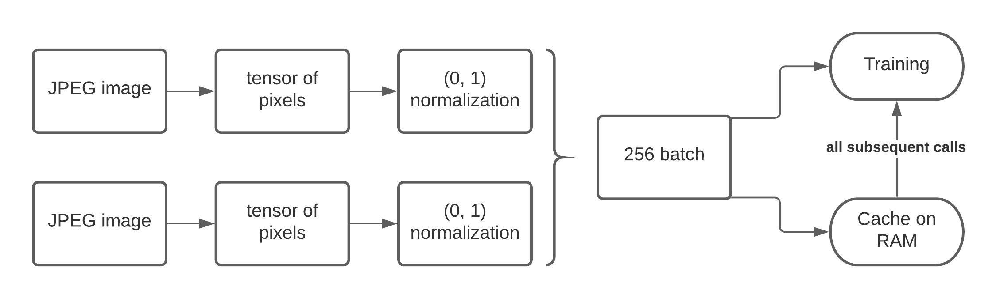
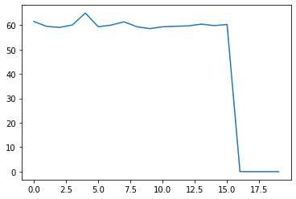
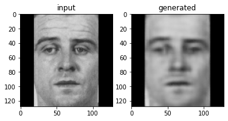

# Final Project Report

**Title: ** Face Alignment with Deep Learning

**Team members: ** Nikolai Sannikov

## Introduction

Facial alignment is a big subproblem of facial recognition. It can be easily done if a photo is taken in frontal projection and a person is looking in a camera[^0]. Unfortunately, not all photos have this feature: people are often looking sideways and a photo is not made at an ideally frontal direction. In my work I would like to attempt to use deep learning techniques to produce an image of a person in a preferable format outlined above.

The biggest problem that I will face in this work is a lack of paired images of the same person in restricted and unrestricted settings. Therefore, there will be no loss function that will provide an optimization feedback directly and I will have to use GAN approach. Normally, such models require lots of resources allocated to training. Unfortunately, I do not possess them and will have to try various optimization techniques to boost training.

## Literature Survey

Facial data manipulation and analysis is a popular problem addressed in a scientific community and there are plenty of articles on this or similar topics. Pipeline of facial recognition and a high importance of face alignment is thoroughly described in an article by Lee et al.[^6]

The basic process of face alignment, its intended goals and inherent problems are outlined by A. Rosenbrock in his article[^0]. He describes a trivial face alignment procedure as applying some geometric transformation to align facial key points (eyes, lips, etc.). This trivial procedure becomes problematic if the person in the photo is not facing the camera at a right angle.

Since the model will have to extract facial features in an unconstrained photo and try to recreate that face in a constrained setting, it has to obtain some information regarding the head position. This point was addressed by Zhuang et al. in their work[^1]. They have used stacked hourglass architecture to improve their results.  A detailed description of hourglass network structure and its principles of work are described by N. Ferdinand in his article "Using Hourglass Networks To Understand Human Poses" [^2]. Later in the experiments hourglass network turned out to be overly complex for this project given the resources I had. This sorrowful assumption was confirmed by K. Kar in his book "Mastering Computer Vision with TensorFlow 2.x" [^3].

Another work with good results on face-related matters with promising results was "AttGAN: Facial Attribute Editing by Only Changing What You Want" by Zenliang He et al.[^7] In this work another architecture is used to change facial attributes, but quite different from the ones in scope my work. Instead of changing the head pose, they are adding or removing various features like beard or glasses without changing the exposition. This architecture turned out to be most applicable to my work in practice given the resources I had.

I have decided to use ADAM optimizer in my work as it was widely used in the related works mentioned above. When I was choosing parameters for my implementation, I was following the guide provided by J. Brownlee in his article[^5]. 

Since I am planning to use TensorFlow, documentation they provide on their website will be useful to me to get some technical details. Some brief overview tutorials, like Cycle-GAN tutorial[^3] will give me some best implementation practices. Another guide that has helped me a lot in this work was related to dataset read optimization.

## Technical Details

### Neural Network Structures
#### Canonical Hourglass
This network structure is widely used in the community. Being the most widely chosen for the tasks like mine, it is the most complex. It makes an advantage of residual blocks that form bottleneck layers and skip layers. Despite being very promising it turned out to be overly complex and too computationally expensive given the resources I had. The upsetting experimental results were supported by K. Kar in his book, where he estimated his training time to be 3 days on Titan X GPU to get at least something able to estimate human posture[^3]. Exact details of my implementation of the bottleneck network can be found in an attached source code as the summary was too large to include in this document.

#### Medium Autoencoder

Medium autoencoder was featured in AttGAN paper and has many features resembling bottleneck architecture where bottleneck layers were simplified to just one Conv2D layer to reduce the number of trainable parameters. Lack of skip layers gives an ability to use encoder and decoder components interchangeably. Medium autoencoder is summarized as follows:

##### Encoder

```
Model: "medium encoder"
InputLayer						(128, 128, 1)         
Conv2D[c=16,k=7,s=2,a='relu']  	(64, 64, 16)
BatchNorm						(64, 64, 16)

Conv2D[c=32,k=5,s=2]  			(32, 32, 32)
LeakyReLU						(32, 32, 32)
BatchNorm						(32, 32, 32)

Conv2D[c=64,k=5,s=2] 			(16, 16, 64)
LeakyReLU						(16, 16, 64)
BatchNorm						(16, 16, 64)

Conv2D[c=128,k=5,s=2] 			(8, 8, 128)
LeakyReLU						(8, 8, 128)
BatchNorm						(8, 8, 128)

Conv2D[c=256,k=5,s=2] 			(4, 4, 256)
LeakyReLU						(4, 4, 256)
BatchNorm						(4, 4, 256)

Conv2D[c=512,k=5,s=2] 			(2, 2, 512)
LeakyReLU						(2, 2, 512)
BatchNorm						(2, 2, 512)

=================================================================
Trainable params: 4,366,608
Embedding shape: (2, 2, 512)
```

##### Decoder

```
Model: "medium decoder"
InputLayer						(2, 2, 512)
Conv2DT[c=256,k=5,s=2,a='relu'] (4, 4, 256)
BatchNorm						(4, 4, 256)

Conv2DT[c=128,k=5,s=2,a='relu'] (8, 8, 128)
BatchNorm						(8, 8, 128)

Conv2DT[c=64,k=5,s=2,a='relu']  (16, 16, 64)
BatchNorm						(16, 16, 64)

Conv2DT[c=32,k=5,s=2,a='relu']  (32, 32, 32)
BatchNorm						(32, 32, 32)

Conv2DT[c=16,k=5,s=2,a='relu']  (64, 64, 16)
BatchNorm						(64, 64, 16)

Conv2DT[c=1,k=3,s=2,a='relu'] 	(128, 128, 1)
=================================================================
Trainable params: 4,366,928
```


#### Light Autoencoder

Light network is used for some basic experiments and was derived from the heavier ones following the path of reducing the number of trainable parameters. It is summarized as follows:

##### Encoder

```
Model: "light encoder"
InputLayer			(128, 128, 1)         
Conv2D[c=4,k=7,s=2]  (64, 64, 4)
BatchNorm			(64, 64, 4)

Conv2D[c=8,k=3,s=2]  (32, 32, 8)
LeakyReLU			(32, 32, 8)

Conv2D[c=16,k=3,s=2] (16, 16, 16)
LeakyReLU			(16, 16, 16)

Flatten				(4096)
Dense				(256)
Dense				(64)
=================================================================
Trainable params: 1,066,632
Embedding shape: (64)
```

##### Decoder

```
Model: "light decoder"
InputLayer					  (64)
Dense						 (256)
Dense						 (1024)
Reshape						 (8, 8, 16)
Conv2DT[c=16,k=3,s=2,a='tanh'] (16, 16, 8)
Conv2DT[c=8,k=3,s=2,a='tanh']  (32, 32, 8)
Conv2DT[c=4,k=3,s=2,a='tanh']  (64, 64, 4)
Conv2DT[c=1,k=3,s=2,a='tanh']  (128, 128, 1)
=================================================================
Trainable params: 280,165
```

### Loss Function

Using GANs for image generation is a very computationally expensive task and using paired data instead is much faster. Therefore, I was trying to train encoder part with MAE loss function whenever it was possible.

When I have had to use GAN, discriminator was structured as a PatchGAN instance, where the output is a set of 32x32px pieces, each of them taking values in range (0,1) where 1 means a real piece and 0 means fake. Discriminator's loss function is binary cross-entropy between the evaluated pieces and an array of ones or zeros. Generator loss in these cases was a binary cross-entropy between an array of ones and discriminator output.

### Optimizer Algorithm

In my work I have used ADAM optimizer. This optimizer is used in most of the related works I have found and its usage is well described in a guide by J. Brownlee[^5]. Learning rate was chosen to be `0.01` for experimental networks to obtain the reasonable results for preliminary experiments before investing more time in various approaches. For actual training it was set to `2e-4`. Exponential decay rate for the first moment estimates $\beta_1 = 0.5$ and exponential decay rate for the second-moment estimates $\beta_2 = 0.999$ as these values are advised for computer vision related models.

### Data Read Optimization

In the first experiments on NYU Prince I have noticed that the time to read data from disk is too large. Fetching data was dominating in epoch time and something had to be done about that. Using TensorFlow native dataset API the following pipeline was implemented:



As a result, the time it takes to read data was significantly decreased for each epoch after the first one. Below is the plot of read times for each batch in the training process:


Such a significant speedup not only allowed me to save lots of time on disk IO, but also allowed to fetch my dataset from cloud storage and make an effective use of Google Colab + Google Drive setup. Apparently, the GPUs this service offers are not much different from NYU Prince while Colab a much better usability due to a simple environment setup and stable connection.

## Results

The results will be presented in order to reflect my line of thoughts. An ultimate goal of this project may be defined as follows: there is a domain of unrestricted photos $U$ that shall be mapped via some function $f$ to a domain of restricted photos $R$. Intuitively, this mapping exists since we can take the same person and make a better photo with a different camera angle and some verbal instructions to that subject. Besides that, it is easy for a human observer to imagine such a transformation, but almost impossible to describe which function should be applied to image pixels. For this work, let us assume this transformation $f$ exists and, therefore, may be a subject to approximation.

To begin with, it is important to understand whether such transformations are possible to approximate using a neural network. In order to support this bald statement with some data, the first experiment with synthetic data was made. I have used domains and transformation function that will be an easy goal: $U$ - polygons with 3 vertices, $f$ - function that mirrors a polygon, $R=f(U)$. 

The second goal that the polygon experiment was aiming at was trying to optimize training by taking advantage of the paired data whenever it is possible. That is why I wanted to experiment with an option to train encoder and $f$-approximating decoder separately: train encoder as a part of VAE system, and only then use its weights to train the desired decoder.

### Experiment 1: Transformation on Polygon Domains

#### Experiment Setup

In this experiment I have written a generator that produces a pair of polygons: $u\in U$ and $r \in R = f(u)$. Since the goal of this experiment is to verify that the goal of this work is possible in theory, I was concentrating on general patterns instead of absolute values of the results.

*NNet Structure*: Light

#### Step 1: Train Encoder

To train encoder, I have used a decoder that learns a shape of a polygon and then decodes it. Let initial polygon be $u$ and reconstructed be $u'$

*Loss Function:* $\sum(|u-u'|)$

The results are not as good as can be imagined, but it is easy to visually observe that some basic shape features are learned:


Even though the results are visually not great, they are sufficient to show the general pattern given a discount for a raw approximation. Encoder is able to create a shape embedding that was sufficient to reconstruct some features of an observed shape. Therefore, a path to the next step of my work is open.

#### Step 2: Decoder that learns $f$

Given an ability of encoder to create an informative embedding, another decoder was trained to learn the transformation function approximation $f'$. It, in its turn, is trained to decode the shape with the previously trained encoder's embedding applying the mirror transformation. 

*Loss Function:* $\sum(|r-f'(u)|)$

By the end of training time, it has learned the basics of that transformation and could successfully perform it (as can be seen from the general pattern):


It can be clearly seen, that decoder was able to understand the general pattern of the transformation function $f$ and pretraining encoders in VAE setting is a reasonable decision. 

#### Conclusion

The results were sufficient to support the methodology of this work: training encoder to extract features of an item $u\in U$ on a reconstruction task, and then reusing same encoder for tasks resulting in $r' = f'(u)$ is reasonable and can be used further in this work. Working with datasets gave me a clue how to reduce the time per epoch by reusing cached dataset parts and executing data preparation pipeline faster.

### Experiment 2: Dealing with Faces
Now it was time to return to the intended domain of this work: to faces. In this experiment, the 2 face domains are present: 

* Unrestricted (from LFW dataset) - domain $U$
* Restricted (from Mugshots dataset) - domain $R$

These domains are not paired, therefore a previously used loss function MAE will be no longer useful. For that reason discriminator was used to compute the loss of domain switch $U\rightarrow R$.

#### Experiment setup

*NNet Structure*: Medium 

#### Step 1:

First, encoder is trained by using a decoder that reconstructs an initial image. In this case, training was going well and reasonable results were obtained on reconstruction just after 3500 epochs on both FLW and Mugshot dataset.

*Loss Function:*$\sum(|u-u'|)$




Loss function in this case steadily decreases and could have taken a few more iterations. But I found the results visually satisfying and have decided to stop training, as the encoder was able to convey the facial data and produce a reasonable encoding.


A good feature of such encodings was that decoders for both LFW and Mugshot dataset were trained independently, while they have had a shared encoder. Apparently, if these decoders are switched (i.e. Mugshot decoder applied to an encoded LFW image), they produce quite interesting results as the one in the image below:


From this example I have decided to draw a conclusion that mugshot decoder reflects facial features and expressions more commonly observed in that specific dataset and limits the reconstructed image to only the facial features it has observed.

#### Step 2:

Decoder trained on a mugshot dataset was used to pre-train the discriminator. Apparently, loss function has 'spiked' at some point, leading to a significant drop in discriminator accuracy. 


I do not yet know what may be a reason of such behavior given that the decoder was not updating its weights in this process. Probably, because of this unexpected behavior, GAN part of the experiment was not producing exciting results in an affordable number of epochs (below 3000). 

I have observed, that often GAN freezes in some semi-constant state and does not change the produced shapes significantly over several hundred epochs. This may be a result of hitting a local minimum by one of these networks and is quite an upsetting outcome.

As a result, in this noise I have found a few runs where the result looked like something like a face:


.png)

Overall, the outcome is quite upsetting. Networks are clearly learning something in a GAN setting: padding is clearly visible. Also, if an observer tries really hard, it may be possible to see some facial features in the produced images (or I was using too much imagination to see at least something).

 - Copy.png)


## Conclusion

Overall, the experiment can not be considered as 100% successful. Obviously, the model is unable to perform a reasonable face alignment. Unfortunately, GANs take too much learning time to show any good results. Without dedicated equipment and optimized system architecture it was quite hard to get a model useful for practice or amusement. Fighting for optimization and reading through plenty of topic-related literature was definitely helpful and significantly improved my understanding of the subject. I believe that given more time and better equipment, results would have been more spectacular. 

In general it seems like the models capable of performing well in this problem setting are too computationally hard to use in practical facial recognition tasks. Since alignment is a subtask that leads to face descriptor extraction, it will be more feasible to just extract better descriptors, but not to spend that much effort on trying to reconstruct an aligned face.

Despite that, this work has many aspects that can be used in other tasks related to image processing. From the useful points, encoder shared by decoders that specialize in different domains does improve the results. Striding and parallelizing dataset fetching significantly boosts the performance as well. These techniques that I have tried and verified their success in this work seem to be worth an effort.

## Source Code

[Experiment 1](https://colab.research.google.com/drive/1WwT34OOwYrCgI6pVcysgcJ1hUbhJ_JMW?usp=sharing)

[Experiment 2](https://colab.research.google.com/drive/1WOQQrH08_GtkIy2KChWlub_x6XCRfiPp?usp=sharing)

[Hourglass Experiment](https://colab.research.google.com/drive/1Y_sNf0EPOBAwcn028p7F07E7JS63lVAS?usp=sharing)

## References
[^0]: [Adrian Rosebrock, "Face Alignment with OpenCV and Python", Pyimagesearch, (2017).](https://www.pyimagesearch.com/2017/05/22/face-alignment-with-opencv-and-python/)
[^1]: [Zhuang et al., "FT-GAN: Face Transformation with Key Points Alignment for Pose-Invariant Face Recognition", MDPI, (19 July 2019) ](https://res.mdpi.com/d_attachment/electronics/electronics-08-00807/article_deploy/electronics-08-00807.pdf)
[^2]: [Nushaine Ferdinand, "Using Hourglass Networks To Understand Human Poses", Towards Data Science, (30 May 2020).](https://towardsdatascience.com/using-hourglass-networks-to-understand-human-poses-1e40e349fa15#:~:text=Hourglass%20networks%20are%20a%20type,image%20into%20a%20feature%20matrix)
[^3]: Krishnendu Kar "Mastering Computer Vision with TensorFlow 2.x", Packt Publishing, (2020)
[^4]: [TensorFlow CycleGAN Tutorial](https://www.tensorflow.org/tutorials/generative/cyclegan)
[^5]: [J. Brownlee, "Gentle Introduction to the Adam Optimization Algorithm for Deep Learning", Machine Learning Mastery, (20 August 2020)](https://machinelearningmastery.com/adam-optimization-algorithm-for-deep-learning/)
[^6]: [Thai Hoang Le, "Applying Artificial Neural Networks for Face Recognition", in "Advances in Artificial Neural Systems", Hindawi Publishing Corporation, (2011).](http://downloads.hindawi.com/archive/2011/673016.pdf)
[^7]: [Zhenliang He et al., "AttGAN: Facial Attribute Editing by Only Changing What You Want"](https://arxiv.org/pdf/1711.10678)
